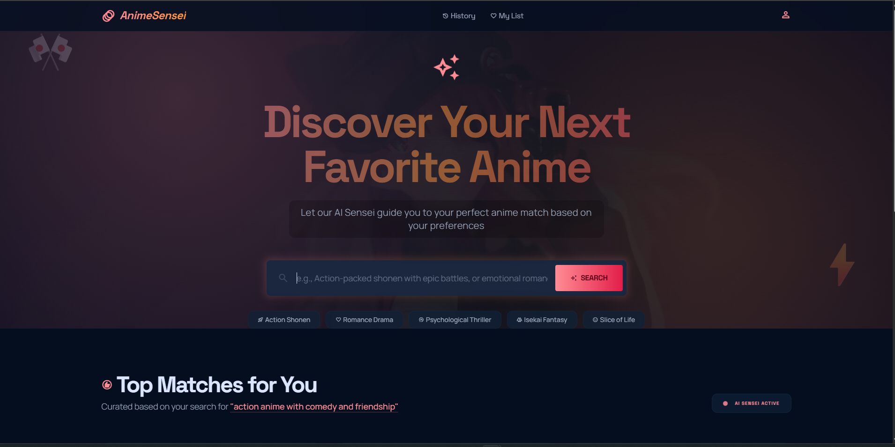
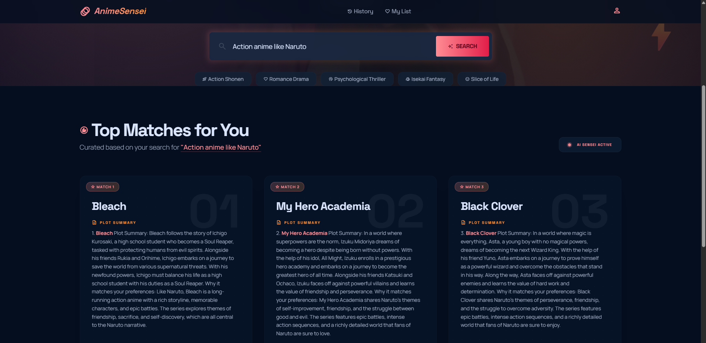
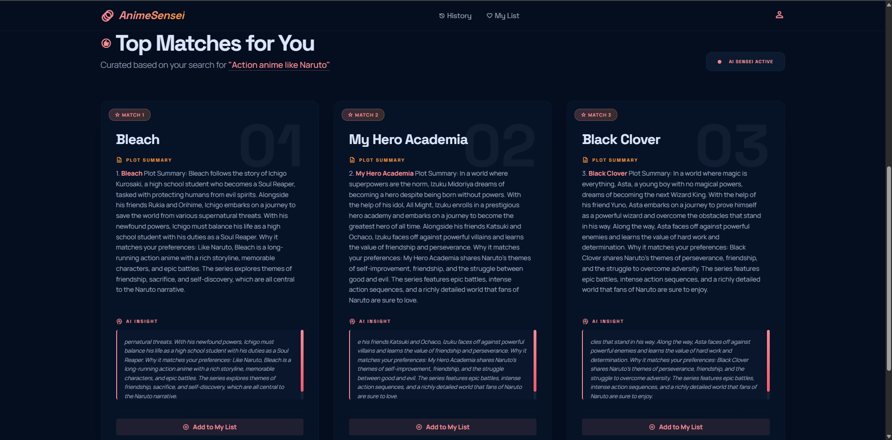
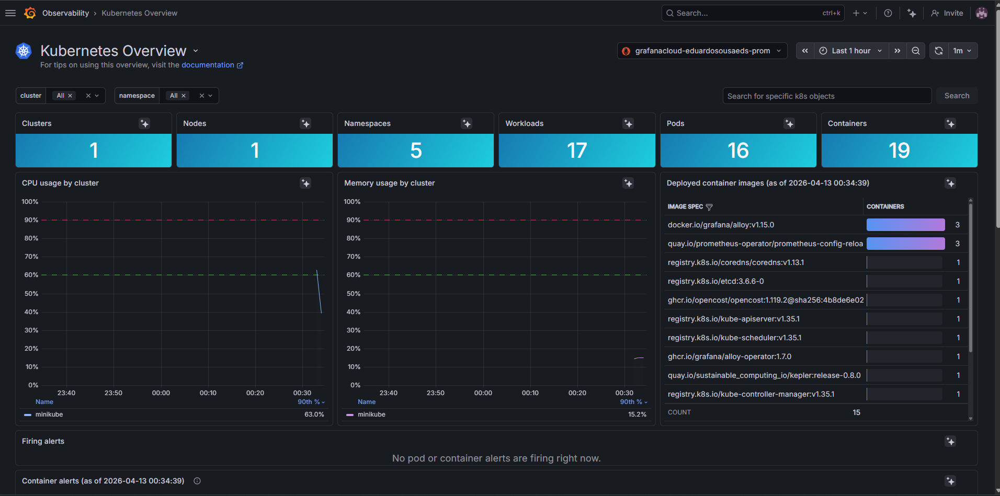

# Anime Recommender Project

An AI-powered anime recommendation system with semantic search and a web interface. The project receives a natural language description, retrieves relevant anime from a local vector database, and uses an LLM to generate three explained recommendations.



## Overview

Anime Recommender was built as an LLMOps/AIOps project to demonstrate a complete AI application workflow:

- Data preparation from an anime CSV dataset.
- Embedding generation with `all-MiniLM-L6-v2`.
- Vector persistence with ChromaDB.
- Semantic retrieval with LangChain.
- Response generation with Groq using the `llama-3.1-8b-instant` model.
- API and web interface with FastAPI.
- Alternative interface with Streamlit.
- Containerization with Docker.
- Kubernetes manifest with health probes.

## Demo

The application allows users to search by preferences such as genre, style, mood, or story type.



After the search, the system returns structured recommendations with a title, plot summary, and an explanation of why each anime matches the provided preference.



The project also includes an observability dashboard demonstration.



## How It Works

The main application flow is:

1. The `data/anime_with_synopsis.csv` file contains the original anime data.
2. The `pipeline/build_pipeline.py` script processes the dataset using `AnimeDataLoader`.
3. The processed output is saved to `data/anime_updated.csv`.
4. `VectorStoreBuilder` loads the processed CSV, splits the documents into chunks, and generates embeddings.
5. The vectors are persisted in the `chroma_db` directory.
6. The API loads the existing vector database and creates a retriever.
7. The user submits a query through the web interface or the `/api/recommend` endpoint.
8. LangChain retrieves the most relevant context.
9. Groq generates the final response with exactly three recommendations.

## Project Structure

```text
anime_recomender_project/
|-- api.py                     # FastAPI API and web interface server
|-- app/
|   `-- app.py                 # Alternative Streamlit interface
|-- config/
|   `-- config.py              # Settings and environment variables
|-- data/
|   |-- anime_with_synopsis.csv
|   `-- anime_updated.csv
|-- pipeline/
|   |-- build_pipeline.py      # Data processing and ChromaDB creation
|   `-- pipeline.py            # Recommendation pipeline used by the API
|-- src/
|   |-- data_loader.py         # CSV loading and preprocessing
|   |-- prompt_template.py     # Prompt used by the LLM
|   |-- recommender.py         # LangChain RetrievalQA chain
|   `-- vector_store.py        # ChromaDB creation and loading
|-- static/
|   `-- js/
|-- templates/
|   `-- index.html             # Main application interface
|-- doc/
|   `-- img/                   # Images used in this README
|-- Dockerfile
|-- llmops-k8s.yaml
|-- requirements.txt
`-- setup.py
```

## Technologies

- Python 3.12
- FastAPI
- Uvicorn
- Streamlit
- LangChain
- LangChain Groq
- Hugging Face Embeddings
- Sentence Transformers
- ChromaDB
- Pandas
- Docker
- Kubernetes
- Grafana

## Prerequisites

Before running the project, make sure you have:

- Python 3.12 installed.
- A Groq API key.
- Docker, if you want to run the application in a container.
- Kubernetes or Minikube, if you want to apply the `llmops-k8s.yaml` manifest.

## Environment Setup

Create a `.env` file in the project root with your Groq API key:

```env
GROQ_API_KEY=your_groq_api_key_here
```

The model used by the application is defined in `config/config.py`:

```python
MODEL_NAME = "llama-3.1-8b-instant"
```

## Local Installation

Create and activate a virtual environment:

```bash
python -m venv venv
```

On Windows PowerShell:

```bash
.\venv\Scripts\Activate.ps1
```

Install the project and its dependencies:

```bash
pip install --upgrade pip
pip install -e .
```

Alternatively, you can install dependencies from `requirements.txt`:

```bash
pip install -r requirements.txt
```

## Generate or Update the Vector Database

If the `chroma_db` directory does not exist yet, or if you want to recreate the embeddings after changing the dataset, run:

```bash
python pipeline/build_pipeline.py
```

This command:

- Reads the `data/anime_with_synopsis.csv` file.
- Validates the `Name`, `Genres`, and `sypnopsis` columns.
- Creates the consolidated `combined_info` column.
- Saves `data/anime_updated.csv`.
- Generates the embeddings.
- Persists the vector database in `chroma_db`.

## Run the FastAPI Application

Start the main server:

```bash
uvicorn api:app --host 0.0.0.0 --port 8000 --reload
```

Open:

```text
http://localhost:8000
```

Automatic API documentation:

```text
http://localhost:8000/docs
```

Health check:

```text
http://localhost:8000/health
```

## Recommendation Endpoint

The main endpoint is:

```http
POST /api/recommend
```

Example payload:

```json
{
  "query": "action anime with comedy and friendship"
}
```

Example response:

```json
{
  "success": true,
  "query": "action anime with comedy and friendship",
  "recommendation": "1. ...",
  "error": null
}
```

## Run with Streamlit

The project also includes a simple Streamlit interface:

```bash
streamlit run app/app.py
```

This version uses the same `AnimeRecommendationPipeline`, but renders the experience directly in Streamlit.

## Run with Docker

Build the image:

```bash
docker build -t llmops-app:local .
```

Run the container using the `.env` file:

```bash
docker run --rm -p 8000:8000 --env-file .env llmops-app:local
```

Open:

```text
http://localhost:8000
```

## Run on Kubernetes

Build the image with the tag expected by the manifest:

```bash
docker build -t llmops-app:latest .
```

Create the secret with your Groq API key:

```bash
kubectl create secret generic llmops-secrets --from-literal=GROQ_API_KEY=your_groq_api_key_here
```

Apply the manifest:

```bash
kubectl apply -f llmops-k8s.yaml
```

Check the resources:

```bash
kubectl get pods
kubectl get svc
```

The manifest creates:

- A `Deployment` named `llmops-app`.
- A container exposing port `8000`.
- Readiness and liveness probes using `/health`.
- A `LoadBalancer` `Service`.

## Observability

The image below shows a Grafana dashboard used to monitor the application:


This type of monitoring is useful for tracking availability, latency, resource usage, and API behavior during tests.

## Important Notes

- The project depends on the `GROQ_API_KEY` environment variable to generate recommendations.
- The `chroma_db` directory contains the persisted vector database.
- If the dataset changes, run `python pipeline/build_pipeline.py` again.
- The `/health` endpoint can be used by orchestration and monitoring tools.
- The main interface is located at `templates/index.html` and consumes the `/api/recommend` API.

## Possible Improvements

- Add automated tests for the pipeline and API.
- Version datasets and embeddings with an artifact strategy.
- Add native metrics with Prometheus.
- Create a CI/CD pipeline for build, test, and deployment.
- Improve the LLM response parser to return structured JSON.
- Add real search history and a favorites list.

## Author

Project developed by Eduardo Sousa as part of LLMOps and AIOps studies.
